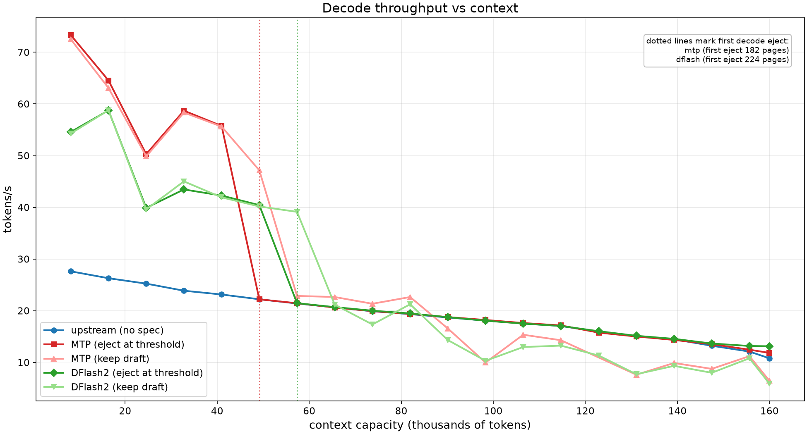
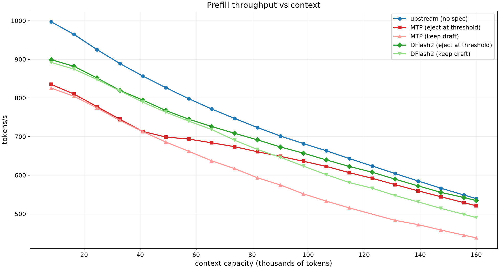

# DFlash2 phase-arena integration plan

Goal: run the DFlash2 draft from the same phase arena as MTP - draft
weights and draft KV in the pinned region, with the dynamic eject
controller and the `--kv-stream-spec-*` options.

Status: DFlash2 already runs on the condensed target without the arena.
The vocab adaptation and the CLI rename are done. This plan covers only
the arena/pin/eject generalization.

Outcome: implemented on `feature/mtp-next-steps`. The draft is pinned by
its weights plus the widened recurrent-state cache; the draft KV is not
pinned (see "Outcome" at the end, which also records the measured
thresholds).

## Current state

- Adapted draft: `Qwen3.8-27B-ASCII-Condensed-DFlash2-Q2_K_S-MIX.gguf`
  (535 MB), built by `gguf-py/gguf/scripts/gguf_condense_dflash.py`.
  Verified on the condensed target: 58.25 t/s decode, acceptance 0.59,
  mean accepted len 3.32 (stock-vocab baseline 53.65 t/s, 0.62).
- Everything that reserves arena space for the draft is gated on
  `spec_mtp` (any draft type) or `ctx_type == LLAMA_CONTEXT_TYPE_MTP`
  (the MTP KV buffer). DFlash is a separate draft model, so it takes the
  plain `has_draft` path: `kv_stream_arena_mib = 0` on its own context,
  no pinned buffer, no window cap.

## The ordering problem

The target context sizes and reserves the pinned region during
construction, before the draft model is loaded.

- For MTP this works because the MTP KV geometry is the target's own
  nextn layer: `mtp_kv_bytes_per_token()` reads `hparams.n_layer()`.
- For DFlash the draft KV geometry lives in the draft GGUF, which is
  only opened later in `common_speculative_init_result`.

So the pin cannot be sized from the draft context. It must be sized from
the draft GGUF metadata, or the pin must grow after the draft is loaded.

## Options

### A. Size the pin from the draft GGUF metadata (recommended)

Compute the draft KV bytes per token in `common.cpp` while building the
target cparams, by reading the draft GGUF metadata (same information the
fit path already opens). Pass two new context-param fields:

- `uint64_t draft_kv_bytes_per_token` - sum over the draft attention
  layers of `ggml_row_size(type_k, n_embd_k_gqa(il)) + ggml_row_size(type_v,
  n_embd_v_gqa(il))`;
- `uint32_t draft_kv_layers` - for status/logging.

Reuse the existing `mtp_weights_bytes` (draft file size) as the draft
weights reservation; rename it to `draft_weights_bytes` in a second pass.

Pros: keeps the current one-shot arena allocation, no new API.
Cons: needs a metadata-only GGUF read in common.cpp.

### B. Grow the pin after the draft loads

Add a second phase that extends the pinned region once the draft context
exists (`llama_kv_stream_*` on the target after `spec_create`). The arena
already supports `reset_pinned_fn` + `set_pinned_fn`, so a re-pin is
possible, but it is a larger change (re-reserve mid-run, react to
failure) and the controller would need a new startup sequence.

### C. Window the draft KV without the arena pin (fallback)

Cap the DFlash draft `n_ctx` to a window and slide its KV (the eviction
added for MTP), but leave the draft weights and KV as ordinary
allocations. Simple, but the draft no longer shares the arena, so total
VRAM is higher and eject cannot return draft memory to the pool.

Recommendation: A. It matches the existing MTP design and keeps the
allocation model unchanged.

## Gating changes (all options need these)

1. Rename the "this context pins a draft" flag from `spec_mtp` to
   `spec_draft` (MTP or DFlash/DSpark). Keep a separate MTP-specific flag
   for the nextn graph, `llama_set_embeddings_nextn`, and
   `llama_model_borrow_output`.
2. `kv_stream_pinned_bytes_for()`: use `draft_kv_bytes_per_token *
   draft_kv_tokens` for any pinned draft; keep the single-layer nextn
   path only for MTP.
3. `kv_secondary_buft` / `rs_secondary_buft` in `llama_memory_params`:
   gate on `params.ctx_other != nullptr && spec_draft_configured`, not
   `ctx_type == LLAMA_CONTEXT_TYPE_MTP`. The draft context keeps
   `ctx_other = ctx_tgt`; the target keeps `rs_secondary_buft`.
4. Draft context caps: apply the window cap
   (`min(n_ctx, st.draft_kv_pages * 256)`) and the `n_ubatch` cap to any
   pinned draft, not only MTP.
5. Toggle: generalize `kv_stream_mtp_set` to `kv_stream_draft_set`. The
   rs rebuild is already generic; the MTP-only part is
   `llama_set_embeddings_nextn`. For DFlash the enable/disable must use
   the DFlash feature toggles (`llama_set_embeddings_layer_inp` on the
   target, `llama_set_embeddings_nextn` on the draft) and the server must
   know which calls to make.
6. Server controller: rename `spec_mtp_enabled_dynamic` to
   `spec_draft_enabled_dynamic`; allow DRAFT_DFLASH/DSPARK in the
   "only spec type" check; make `mtp_eject`/`mtp_enable` dispatch on the
   active draft type.

## Steps

1. Add `draft_kv_bytes_per_token` (+ `draft_kv_layers`) to
   `llama_context_params` (`include/llama.h`) and `llama_cparams`
   (`src/llama-cparams.h`), copy in the context ctor.
2. In `common.cpp`, when the draft is pinned, read the draft GGUF
   metadata and fill the two fields.
3. `src/llama-context.cpp`: use the new fields in
   `kv_stream_pinned_bytes_for`; gate `kv_secondary_buft` /
   `rs_secondary_buft` on the pinned-draft flag.
4. `common/speculative.cpp`: set `ctx_type` / `ctx_other` and the pinned
   weights buffer for DFlash; apply the window and `n_ubatch` caps.
5. `tools/server/server-context.cpp`: generalize the dynamic controller,
   the eject/enable dispatch, and the "only spec type" check.
6. Rebuild, then measure DFlash2 TG/PP versus MTP at 20/40/80/120/160K
   and find the crossover.

## Tests

- MTP regression: the existing MTP sweeps must reproduce.
- DFlash2 with the arena: server starts, the draft KV and weights report
  as pinned, eject returns them, decode beats the no-arena baseline at
  long context.
- Acceptance stays near the 0.59 measured without the arena.

## Risks

- The draft KV is 5 attention layers, much larger per token than the
  single-layer MTP KV; at arena 3072 a 48K window is roughly 400 MB.
  Size the window with `--kv-stream-spec-kv-pages` if needed.
- DFlash `n_max` up to 15 would pin ~2.4 GB of recurrent rows; keep
  `--spec-draft-n-max` at 3-5 on a 16 GB card.
- Ejecting DFlash must not disturb the target feature wiring
  (`llama_set_embeddings_layer_inp`); verify a re-enable leaves the
  target usable.

## Outcome

Implemented on `feature/mtp-next-steps`. Deviations from the options above:

- Weights-only pin. All five DFlash2 draft KV layers are sliding-window
  (window 2048), so the draft KV is about 40 MB and stays in ordinary
  VRAM. Pinning it would need a buft path through `llama_kv_cache_iswa`,
  which the plan did not cover. The pinned region holds the draft weights
  (535 MB) and the widened recurrent-state cache instead.
- No `draft_kv_bytes_per_token` / `draft_kv_layers` fields. Option A was
  not needed for the weights-only pin. The existing `mtp_weights_bytes`
  was renamed to `draft_weights_bytes`, and a new `spec_draft` flag gates
  the pin for any draft type; `spec_mtp` stays the MTP-only selector.
- The `n_ubatch` cap in `common/speculative.cpp` was still gated on
  `spec_mtp`. Generalizing it to `spec_draft` was required: without it the
  DFlash2 draft context allocated a full prefill compute buffer and the
  usable arena was about 300 MiB smaller.

Files changed: include/llama.h, src/llama-cparams.h, src/llama-context.h,
src/llama-context.cpp, common/common.cpp, common/speculative.cpp,
tools/server/server-context.cpp.

The eject/enable dispatch clears the DFlash target feature taps
(`llama_set_embeddings_layer_inp`, via `llama_model_target_layer_ids`)
before `spec_destroy`; the draft constructor re-arms them on re-enable.

### Measured thresholds

Sweep from 8K through 160K in 8K steps, each draft at its largest
validated arena (MTP 3136 MiB, DFlash2 3200 MiB, no-spec 3072 MiB),
`--ctx-size 160000`, q8_0 K / q4_0 V, 256-token decode. Full tables and the
figures are in the fork README; `benchmarks/results/draft-thresholds.csv` holds
the raw numbers.

Findings:

- No ejection while the working set fits: eject == keep up to the
  streaming onset (MTP about 49K, DFlash2 about 57K).
- The default ejects at onset, too early. Keeping is 1.8 to 2.1x faster
  there (MTP 49K: 47.2 vs 22.2 t/s; DFlash2 57K: 39.1 vs 21.5 t/s).
- Keep wins to about 81K and loses from about 90K. Crossover about 85K, or
  about 330 pages/layer, for both drafts.
- After ejection, decode tracks the no-spec baseline (98K: 18.2 vs 18.1).
- Robust eject threshold about 300 pages/layer.

Not done: moving the default eject threshold to about 300 pages/layer. The
MTP keep point at 122880 is missing because of a pre-existing
streaming-kernel launch timeout that reproduces on an untouched build.
